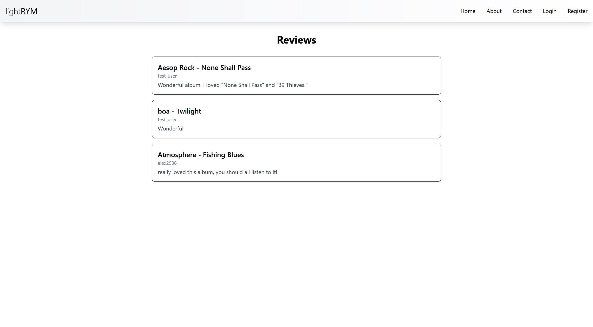
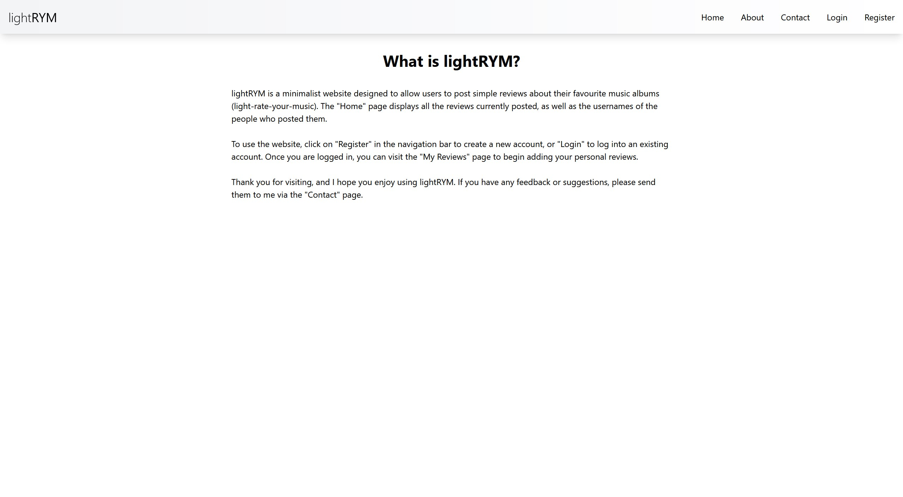
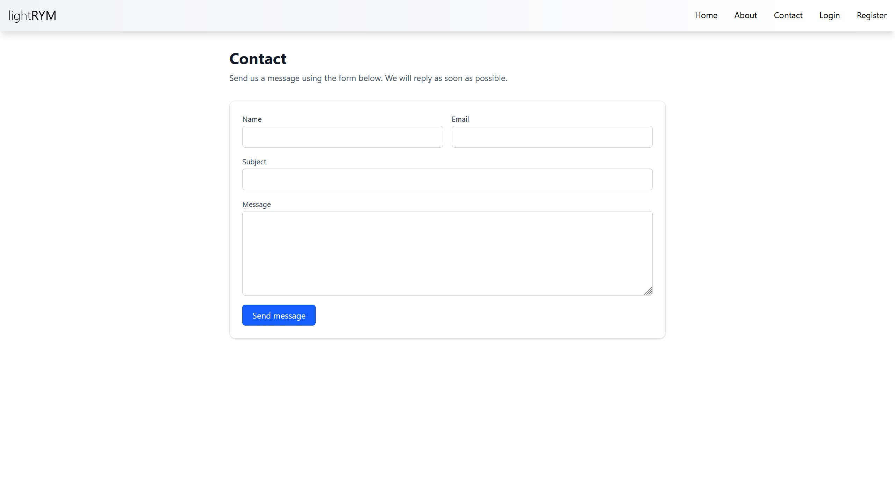
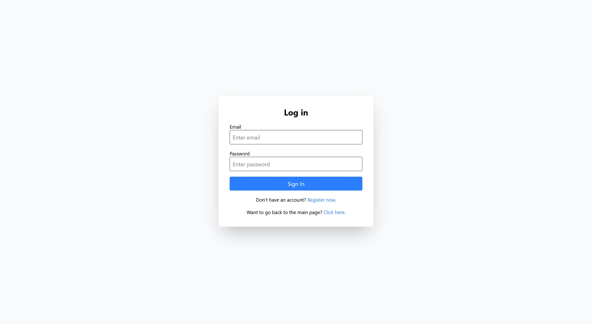
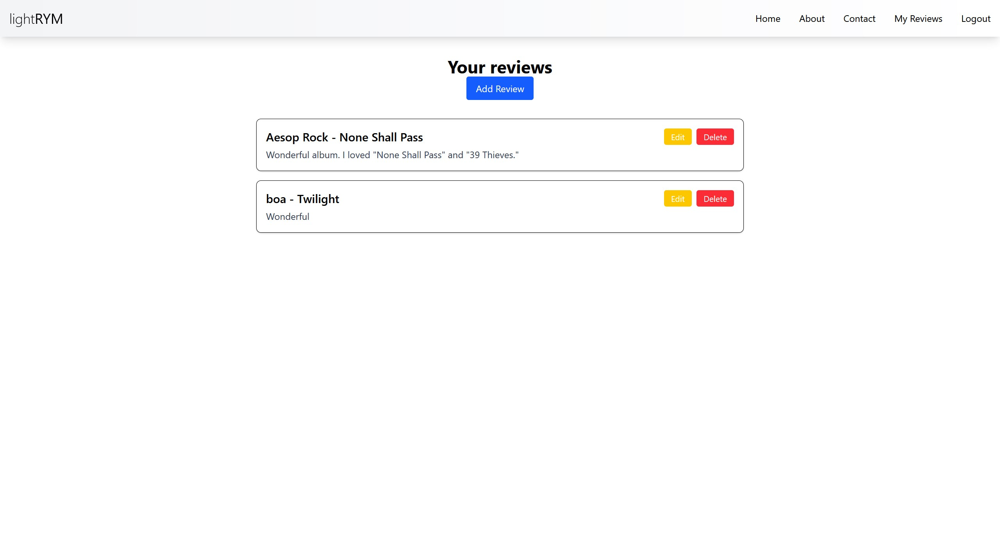

# lightRYM - minimal music review web-app
Jinga Ștefan-Andrei, Grupa 1146

Prezentare video: https://youtu.be/x8q7Q7VWLrk

Link aplicație publicată: https://proiect-cc-simpre-ten.vercel.app/

GitHub repo: https://github.com/forestcrunk/proiect-cc-simpre

## 1. Introducere

lightRYM este o aplicație web minimalistă ce permite utilizatorilor să posteze review-uri pentru albume de muzică (light-rate-your-music). În dezvoltarea acestei aplicații, am utilizat serviciile cloud **MongoDB Atlas** ca bază de date și **SendGrid** pentru a facilita transmiterea de feedback prin email, iar aplicația a fost publicată pe Vercel.

## 2. Descriere problemă

Am dorit să creez o aplicație web portabilă și ușor de folosit, astfel încât oricine poate să cloneze codul sursă și să își hosteze propria mini-bază de date de review-uri pentru uz personal, fie pentru un singur utilizator, fie pentru un grup mai larg de prieteni sau o mică comunitate online. Astfel, am implementat doar strictul necesar, iar oricine dorește să adauge mai multe funcționalități poate să modifice codul sursă pentru a se potrivi nevoilor sale.

## 3. Descriere API

Aplicația include un API RESTful implementat cu ajutorul Next.js, aflat în `app/api/`. Endpoint-urile folosite includ:
* `/api/reviews` (GET)
    * Obține toate review-urile din baza de date
* `/api/my_reviews` (GET, POST)
    * GET: Obține toate review-urile utilizatorului conectat
    * POST: Adaugă un nou review
* `/api/my_reviews/<id>` (GET, PUT, DELETE)
    * Citire, actualizare sau ștergere pentru un review individual
* `/api/users/register` & `/api/users/login` (POST)
    * Înregistrare utilizator nou și conectare ca utilizator

## 4. Exemple request/response

**Request**: GET /api/reviews

**Response**: 200 OK

```json
[
    {
        "_id": "6a00aa7a8b888514153bb410",
        "artist": "Aesop Rock",
        "album": "None Shall Pass",
        "review_text": "Wonderful album. I loved \"None Shall Pass\" and \"39 Thieves.\"",
        "username": "test_user",
        "userId": "6a006d5c0251fef1f8e2e4e7"
    },
    {
        "_id": "6a00b62872a018615fde1d36",
        "artist": "boa",
        "album": "Twilight",
        "review_text": "Wonderful",
        "username": "test_user",
        "userId": "6a006d5c0251fef1f8e2e4e7"
    },
    {
        "_id": "6a00b99672a018615fde1d37",
        "artist": "Atmosphere",
        "album": "Fishing Blues",
        "review_text": "really loved this album, you should all listen to it!",
        "username": "alex2906",
        "userId": "6a00b1866fa98d58780d40a6"
    }
]
```

**Request**: POST /api/users/register

```json
{
    "username": "michael6",
    "email": "michael6@stud.ase.ro",
    "password": "12345678"
}
```

**Response**: 201 Created

```json
{
    "_id": "6a00c46a16d0d413a973cdf6",
    "username": "michael6",
    "email": "michael6@stud.ase.ro",
    "password": "$2b$10$OLN6EHrLsQcc2l6hvh5mieyBTPBlcXjYr3yst6d.pt9lULP6kTujW",
    "createdAt": "2026-05-10T17:46:18.734Z"
}
```

**Request**: GET /api/my_reviews

*Request Headers*: `userId: "6a006d5c0251fef1f8e2e4e7"`

**Response**: 200 OK

```json
[
    {
        "_id": "6a00aa7a8b888514153bb410",
        "artist": "Aesop Rock",
        "album": "None Shall Pass",
        "review_text": "Wonderful album. I loved \"None Shall Pass\" and \"39 Thieves.\"",
        "username": "test_user",
        "userId": "6a006d5c0251fef1f8e2e4e7"
    },
    {
        "_id": "6a00b62872a018615fde1d36",
        "artist": "boa",
        "album": "Twilight",
        "review_text": "Wonderful",
        "username": "test_user",
        "userId": "6a006d5c0251fef1f8e2e4e7"
    }
]
```

## 5. Capturi de ecran din aplicație

<p style="text-align: center;">Figura 1 - Homepage</p>

<p style="text-align: center;">Figura 2 - About</p>

<p style="text-align: center;">Figura 3 - Contact</p>

<p style="text-align: center;">Figura 4 -Login</p>

<p style="text-align: center;">Figura 5 - Register</p>

<p style="text-align: center;">Figura 6 - User reviews</p>
